# OraMedha

A multi-tenant dental practice management platform — patient records, scheduling, a live queue, billing, and a deterministic business-intelligence engine ("Business Brain"), built on Next.js 15 and Supabase.

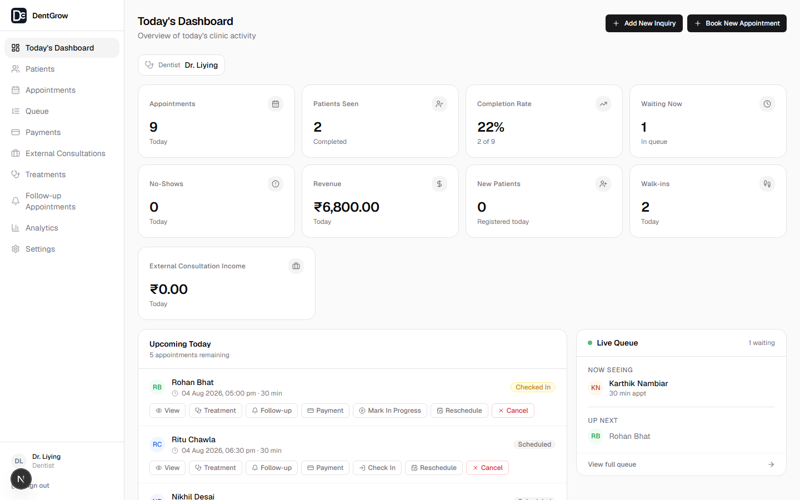

## Why this exists

Small and mid-size dental clinics run on paper registers, WhatsApp reminders, and a receptionist's memory for who's owed money. OraMedha centralizes that: patient records, appointment lifecycle, a real-time waiting room, treatment and billing history, consultant payouts, follow-up recall, and a rules-based diagnostic layer that tells a dentist *why* a metric moved, not just that it did.

## Screenshots

| Dentist Dashboard | Appointments | Live Queue |
|---|---|---|
|  | 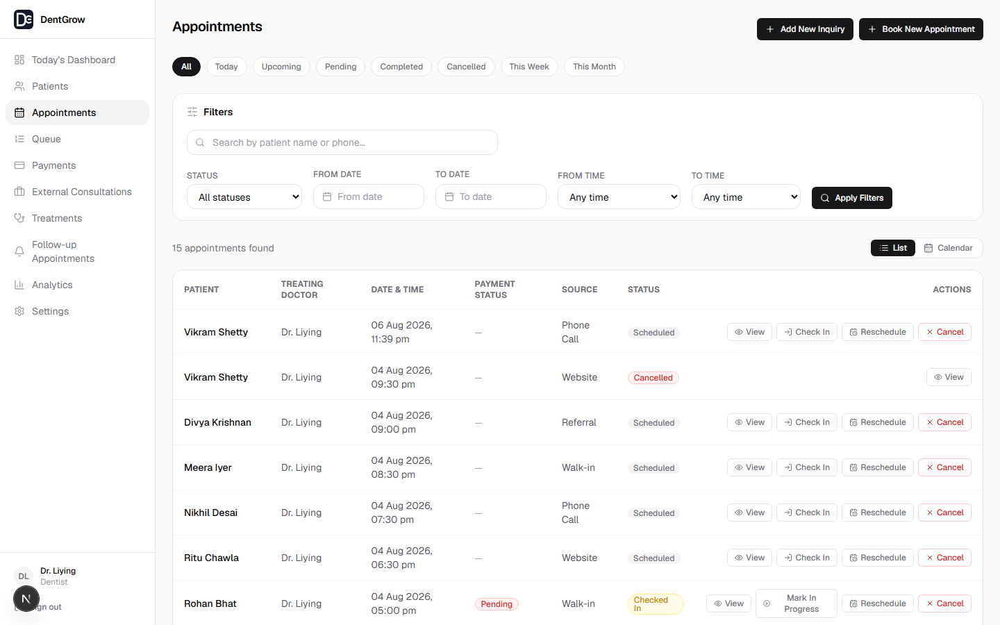 | 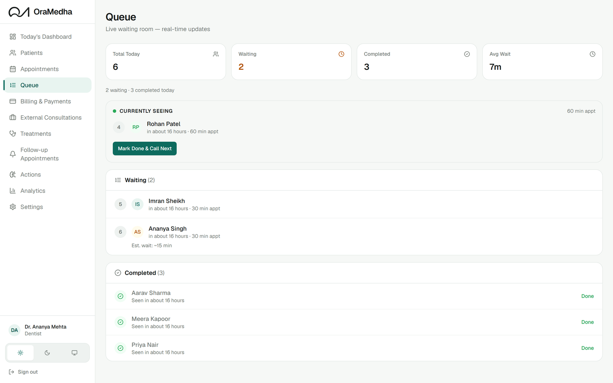 |

| Patients | Follow-ups | Business Brain |
|---|---|---|
| 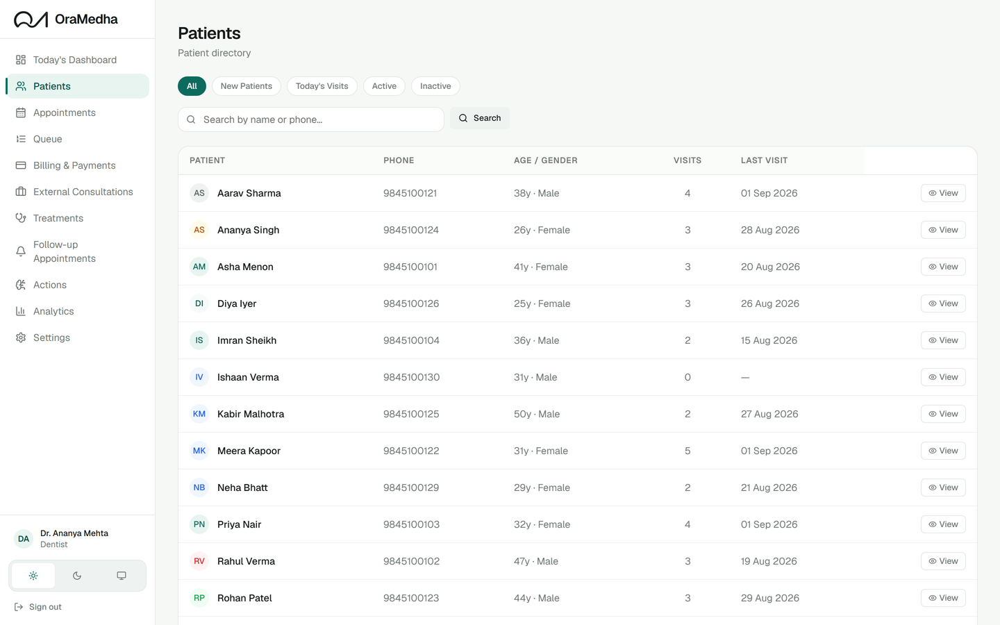 | 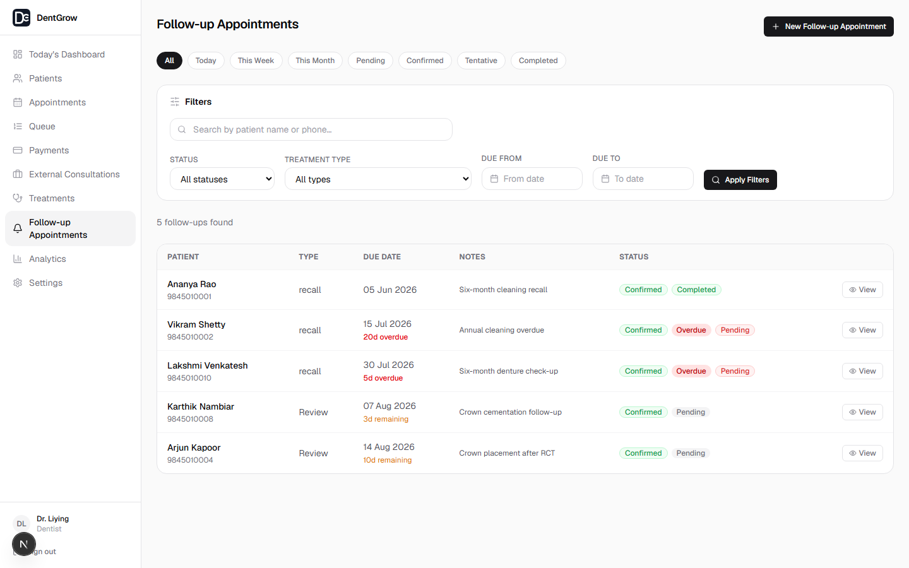 | 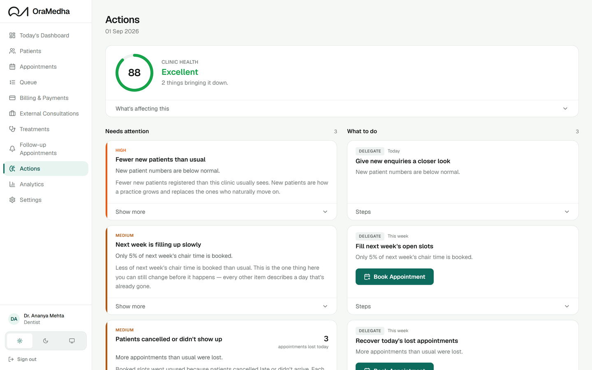 |

| Receptionist Dashboard | Patient Portal | Payments |
|---|---|---|
| 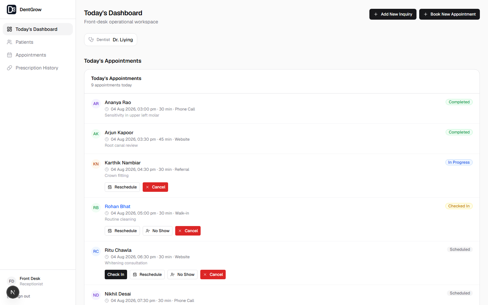 | 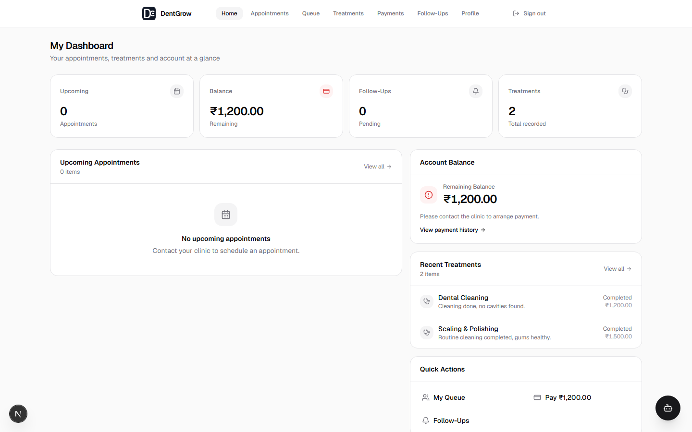 | 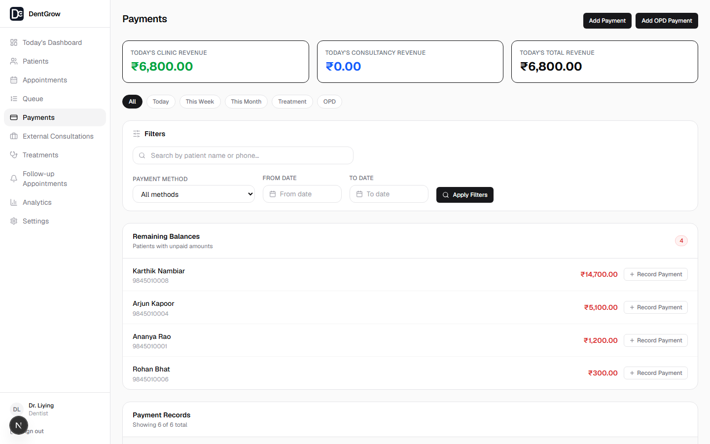 |

## Tech stack

| Layer | Choice | Why |
|---|---|---|
| Framework | Next.js 15 (App Router), React 19 | Server Components for data-heavy dashboards, Server Actions for mutations — no separate REST/GraphQL layer to maintain |
| Language | TypeScript, strict mode | Billing math and appointment state machines are exactly the kind of code where a wrong type should fail the build, not production |
| Database | Supabase (Postgres) | Row Level Security enforces clinic isolation at the database layer, not just in application code — the same guarantee holds even if a query is written wrong |
| Auth | Supabase Auth | Session cookies handled server-side; roles (`dentist`, `receptionist`, `patient`) resolved once per request and cached |
| Validation | Zod | Every Server Action parses its input before touching the database — the schema *is* the contract |
| Styling | Tailwind CSS 4 | Utility-first, no CSS file sprawl across 400+ components |
| Data fetching | TanStack Query (client) + Server Components (initial load) | Server-rendered first paint, client-cached refetches for filters/pagination |
| Scheduling | pg_cron + pg_net | Recurring jobs (no-show detection, metric history) live in Postgres itself — no separate worker process to deploy or monitor |
| Testing | Vitest | One runner for pure unit tests and real-Postgres integration tests |

## Architecture

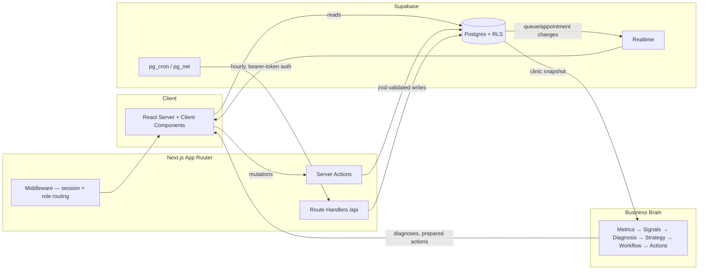

Every table carries `clinic_id`, and every RLS policy checks it against the caller's session — a receptionist at Clinic A cannot read Clinic B's patients no matter what the application code does. Server Actions re-derive `clinic_id` from the session on every call rather than trusting a client-supplied value.

## Business Brain

The Business Brain is a deterministic pipeline that turns raw clinic activity into plain-language findings, without an LLM anywhere near the reasoning:

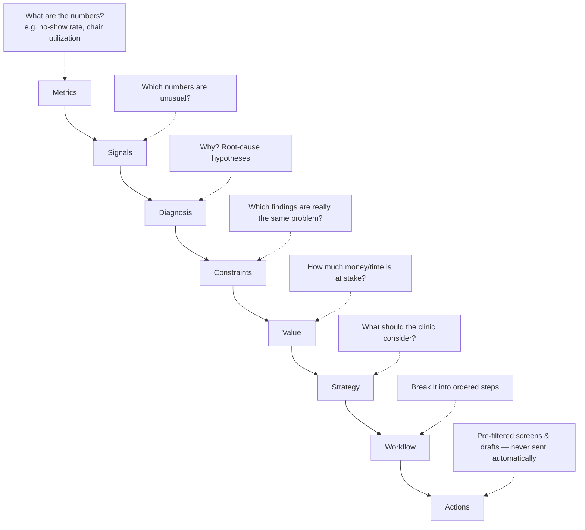

Each stage is a pure function with no database access and no network calls — the engines take a typed snapshot in and return typed findings out, which is what makes the whole pipeline byte-for-byte reproducible and unit-testable without mocking Postgres. The Action stage prepares work (a filtered patient list, a draft reminder) but never executes it; a human always makes the final call. An `AIExplanationEngine` layer exists to rephrase findings in plain language, with a deterministic verifier that rejects any explanation introducing a fact the pipeline didn't produce — the model can restate, never reason.

The Business Brain is gated to an explicit allow-list of demo clinics and is architecturally one-way: it depends on the rest of the app, never the other way around.

## Engineering highlights

- **Multi-tenant by construction** — RLS on every table, `clinic_id` re-derived server-side on every write, never trusted from the client.
- **Idempotent scheduled jobs** — the no-show and metric-history cron jobs run hourly via `pg_cron`/`pg_net`; each is a conditional `UPDATE` that matches zero rows on a second run, so an overlapping or retried invocation is a no-op rather than a double-charge or duplicate write.
- **Audit trail on appointments** — every status transition writes an immutable history row (old value, new value, who, when), because "why was this cancelled" is a question a clinic actually asks.
- **Billing correctness under composition** — outstanding balance is one function (`computeOutstandingBalance`) covering treatment cost, OPD consultation fees, and X-ray charges, so it can't be computed three slightly-different ways across three screens.
- **Consultant payouts tied to cash collected, not invoiced value** — a consultant earns their share proportional to what the clinic has actually been paid, not the moment a treatment is logged.
- **Real-time queue** — Supabase Realtime pushes queue position changes to every connected client (dentist, receptionist, patient) without polling.
- **Deterministic diagnostics** — the Business Brain pipeline is pure functions over typed snapshots; no hidden state, no non-determinism to chase down in a bug report.

## Testing

**746 tests across 60 files, all passing.**

- **Unit tests** for pure business logic — billing math, payout allocation, scheduling windows, date/timezone utilities — no I/O, run in milliseconds.
- **Integration tests** against a real local Postgres (via the Supabase CLI), not mocks — RLS policies, triggers, and cron-job SQL functions are exercised as actual SQL, because a mocked query can't catch a broken policy.
- **Route handler tests** call cron/webhook handlers directly (auth rejection, malformed payloads) without spinning up a server.
- Tests that need the local database skip themselves loudly when it isn't running, rather than failing the whole suite in an environment that hasn't started it.

```bash
npm run test        # vitest --run
npm run type-check   # tsc --noEmit
npm run db:lint      # Supabase RLS/schema linter
```

## Project structure

```
app/                  Next.js App Router — (auth), (dashboard)/{dentist,receptionist}, portal, api
actions/               Server Actions — the only mutation path; each re-validates session + clinic_id
components/            UI, split by role (dentist/, receptionist/, patient/) plus shared/ and ui/ primitives
lib/                   Supabase clients, billing math, scheduling, auth session, AI provider adapters
business-brain/        The deterministic pipeline — pure engines, no DB or React imports allowed
supabase/migrations/   Every schema change, versioned and forward-only
types/                 Zod schemas + shared TypeScript types, one source of truth per entity
```

## Setup

```bash
git clone https://github.com/Hardik884/OraMedha.git
cd OraMedha
npm install

cp .env.example .env.local   # fill in Supabase + Gemini keys

npm run db:start   # local Supabase via Docker
npm run db:reset   # apply migrations + seed data

npm run dev        # http://localhost:3000
```

Local sign-in (seeded): `dentist@dentgrow.test` / `receptionist@dentgrow.test`, password `password123`, clinic "Dr. Liying's Dental Care".

### Deployment

The app deploys to Vercel; Supabase migrations are pushed independently with `npm run db:push`. Two `pg_cron` jobs (no-show detection, metric history) call back into the app over HTTPS with a bearer token compared in constant time — both fail closed if the shared secret isn't configured.

---

Built by [Hardik884](https://github.com/Hardik884).
